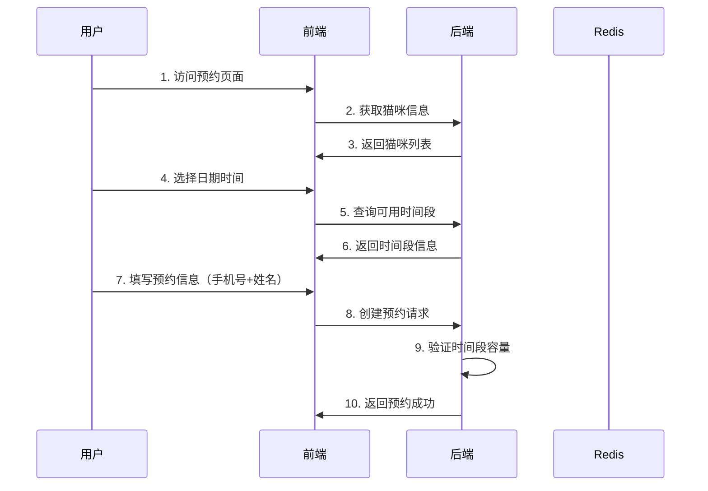
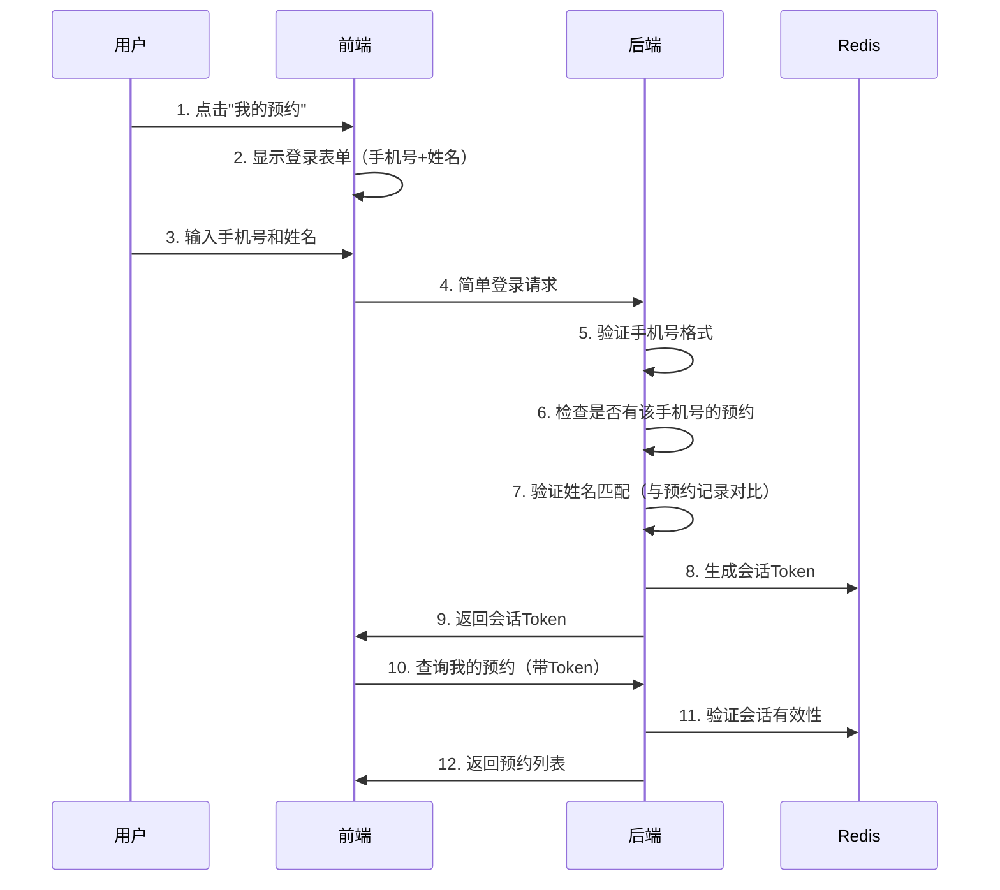
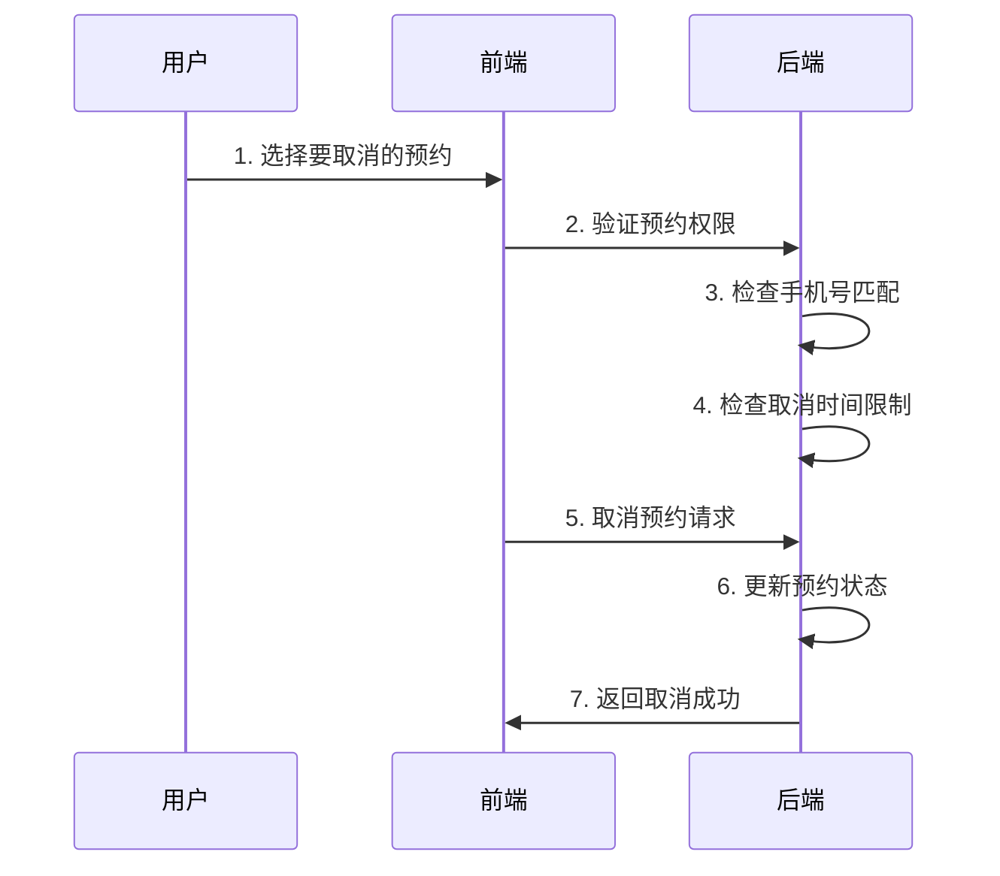

# 撸猫社团预约系统 - 用户身份识别和业务流程

## 用户身份识别方案

我们采用**手机号+姓名会话认证**的无SMS成本方案：

## 方案特点

**优点：**
- 🎯 **零SMS成本** - 不需要短信验证码
- 🔒 **适度安全** - 需要同时知道手机号+姓名才能登录
- 👤 **身份验证** - 只有已预约用户才能登录，防止随意查看
- 📱 **会话管理** - 支持24小时会话，无需重复登录
- 🚀 **体验良好** - 用户记住预约时填写的姓名即可

**工作原理：**
- 用户创建预约时提供手机号和姓名
- 查询预约时需要同时输入手机号和姓名进行验证
- 系统验证姓名与预约记录是否匹配
- 验证通过后生成24小时有效的会话Token

## 完整业务流程

### 1. 用户预约流程



### 2. 用户查询预约流程



### 3. 用户取消预约流程



## API接口设计

### 会话认证接口

#### 1. 简单登录（手机号+姓名）
```http
POST /api/simple-user/login
{
  "phone": "13800138000",
  "name": "张三"
}

Response:
{
  "success": true,
  "data": {
    "sessionToken": "session_abc123def456",
    "phone": "13800138000",
    "name": "张三"
  }
}
```

#### 2. 查询我的预约
```http
GET /api/simple-user/my-bookings
Headers: {
  "Session-Token": "session_abc123def456"
}
```

#### 3. 取消我的预约
```http
DELETE /api/simple-user/cancel-booking/123
Headers: {
  "Session-Token": "session_abc123def456"
}
Body: {
  "cancelReason": "临时有事"
}
```

#### 4. 验证会话
```http
GET /api/simple-user/verify-session
Headers: {
  "Session-Token": "session_abc123def456"
}
```

#### 5. 登出
```http
POST /api/simple-user/logout
Headers: {
  "Session-Token": "session_abc123def456"
}
```


### 预约相关接口

#### 1. 创建预约（无需登录）
```http
POST /api/bookings
{
  "date": "2023-12-15",
  "time": "14:00",
  "name": "张三",
  "phone": "13800138000",
  "numberOfPeople": 2,
  "note": "第一次来，很期待"
}
```

#### 2. 取消预约（需要手机号验证）
```http
DELETE /api/bookings/123?phone=13800138000
{
  "cancelReason": "临时有事"
}
```

#### 3. 根据手机号查询预约（兼容接口）
```http
GET /api/bookings/by-phone?phone=13800138000
```

## 安全机制

### 1. 身份验证
- 手机号格式验证
- 姓名与预约记录匹配验证
- 只有已预约用户才能登录

### 2. 会话管理
- 24小时有效期，支持续期
- Redis存储，支持主动登出
- Token包含时间戳和随机字符，防止伪造

### 3. 预约权限验证
- 取消预约需要会话验证
- 查询预约需要身份验证
- 防止恶意操作他人预约

### 4. 业务规则验证
- 营业时间限制
- 时间段容量限制
- 预约取消时间限制
- 手机号格式验证

## 前端实现建议

```javascript
// 1. 创建预约（无需登录）
async function createBooking(bookingData) {
    return await apiService.createBooking(bookingData);
}

// 2. 简单登录（手机号+姓名）
async function login(phone, name) {
    const result = await apiService.simpleLogin(phone, name);
    localStorage.setItem('sessionToken', result.data.sessionToken);
    localStorage.setItem('userPhone', phone);
    localStorage.setItem('userName', name);
    return result;
}

// 3. 查询我的预约
async function getMyBookings() {
    const token = localStorage.getItem('sessionToken');
    return await apiService.getMyBookings(token);
}

// 4. 取消预约
async function cancelBooking(bookingId, reason) {
    const token = localStorage.getItem('sessionToken');
    return await apiService.cancelMyBooking(bookingId, token, reason);
}

// 5. 验证会话
async function verifySession() {
    const token = localStorage.getItem('sessionToken');
    if (!token) return false;
    const result = await apiService.verifySession(token);
    return result.data.valid;
}

// 6. 登出
async function logout() {
    const token = localStorage.getItem('sessionToken');
    await apiService.logout(token);
    localStorage.removeItem('sessionToken');
    localStorage.removeItem('userPhone');
    localStorage.removeItem('userName');
}
```

## 部署配置

### Redis配置
```yaml
spring:
  data:
    redis:
      host: localhost
      port: 6379
      password: 
      database: 1  # 使用专门的数据库存储会话
```

## 业务闭环检查

### ✅ 完整性检查
1. **用户创建预约** - 可以不需要验证码（降低门槛）
2. **用户查询预约** - 可以通过手机号或验证码两种方式
3. **用户取消预约** - 必须验证手机号所有权
4. **管理员管理** - 独立的管理员权限系统
5. **数据安全** - 用户只能操作自己的预约

### ✅ 安全性检查
1. **身份验证** - 手机号+姓名双重验证确保身份真实性
2. **权限控制** - 用户只能操作自己的预约
3. **会话保护** - Token机制防止未授权访问
4. **数据保护** - 敏感信息Redis存储，自动过期

### ✅ 用户体验检查
1. **注册门槛** - 创建预约无需注册，降低使用门槛
2. **查询便利** - 支持便捷的会话管理
3. **操作安全** - 重要操作需要会话验证
4. **错误提示** - 友好的错误信息和操作指导

## 方案优势

### ✅ 核心优势

1. **🎯 零SMS成本**：完全不需要短信验证码，节省运营成本
2. **🔒 适度安全**：需要同时知道手机号+姓名才能登录
3. **👤 身份验证**：只有已预约用户才能登录，防止随意查看
4. **🚀 体验良好**：用户记住预约时填写的姓名即可
5. **📱 会话管理**：支持24小时会话，无需重复登录
6. **🔄 可扩展**：后续可以轻松升级到更复杂的认证方案

---

**业务逻辑完全闭环，可以支持完整的用户预约流程！** 🎉
